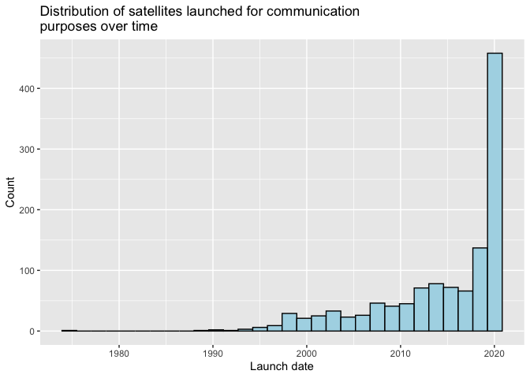
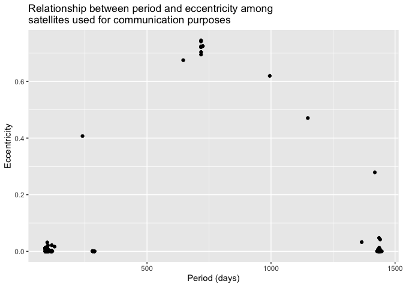

# satellites

<!-- badges: start -->


<!-- badges: end -->

## Background

The `satellites` package was created to provide a simple yet
information-filled research tool for those interested in learning about
the satellites in Earth’s orbit. Learning about astronomy and physics
can be difficult in their own right, and identifying data and then
cleaning that data add another layer of difficulty to that endeavor. I
hope that individuals interested in diving into topics such as
astronomy, physics, math, and/or statistics who might be daunted by the
idea of getting started with their exploration may find this package to
be useful.

I purposefully included only 10 out of the 27 variables from the
original data base to make the data set less overwhelming. Also, I
purposefully did not include variables with hundreds of NA’s, which I
hope will allow for easier analysis (those variables are difficult to
extract much meaning from since there are so many NA’s). Finally, by
making a package for the `satellite` data set, a description of the
variables is easily accessible and visible through the “Help” tab
through running `?satellites`. While the UCS Satellites Database
contains documentation on their data, which can be found
[here](https://s3.amazonaws.com/ucs-documents/nuclear-weapons/sat-database/4-11-17-update/User+Guide+1-1-17+wAppendix.pdf),
I found it cumbersome to go back and forth between the data and the
documentation as I was trying to figure out what each variable
represented, so the data set description that is built-in to the package
seeks to remove this burden.

## About the data set

The `satellites` data set has 2670 observations and 10 variables. Each
observation represents a satellite in Earth’s orbit, with the name of
each satellite given by the `official_name` variable. Additionally,
there are categorical variables for: the country registered as
responsible for the satellite; the affiliation of the user of the
satellite (e.g., “commercial,” “military,” etc.); the purpose of the
satellite (e.g., “earth observation”, “communications,” etc.); and the
satellite’s class of orbit. The data set also contains four numeric
variables pertaining to each satellite’s orbit, as well as the each
satellite’s launch date.

Note that the [Union for Concerned Scientists
(UCS)](https://www.ucsusa.org/) first published data on the satellites
orbiting Earth in their Satellite Database in 2005, and they have
updated the database multiple times since then. This package features
the data from the April 1, 2020 release (which includes satellite
launches through March 31, 2020).

## Installation

You can install the released version of satellites from
[GitHub](https://github.com/) with:

``` r
# install.packages("remotes")
remotes::install_github("nfrontero20/satellites")
```

## Navigating the repository

The files needed to create the data package are found in three folders, [R](https://github.com/nfrontero20/satellites/tree/master/R), [data-raw](https://github.com/nfrontero20/satellites/tree/master/data-raw), and [data](https://github.com/nfrontero20/satellites/tree/master/data).  These folders contain the following documents: 

  - R: 
    - [satellites_documentation.R](https://github.com/nfrontero20/satellites/blob/master/R/satellites_documentation.R)
  - data-raw: 
    - [UCS-Satellite-Database-Officialname-4-1-2020.xls](https://github.com/nfrontero20/satellites/blob/master/data-raw/UCS-Satellite-Database-Officialname-4-1-2020.xls)
    - [UCS-Satellite-Database-4-1-2020.xls](https://github.com/nfrontero20/satellites/blob/master/data-raw/UCS-Satellite-Database-4-1-2020.xls)
    - [satellites_wrangle.R](https://github.com/nfrontero20/satellites/blob/master/data-raw/satellites_wrangle.R)
  - data
    - [satellites.rda](https://github.com/nfrontero20/satellites/blob/master/data/satellites.rda)

## Example of data exploration and data analysis

Here you will see three questions that can be answered using the
`satellites` data set. These three analyses only scratch the surface of
the computations and insights that can be extracted from this data set.

``` r
# Getting the packages we will need
library(satellites)
library(tidyverse)
library(kableExtra)
```

**Example 1: What are the top 5 purposes/uses for the satellites?**

``` r
# Tally the number of satellites for each purpose
purposes_tally <- satellites %>% 
  group_by(purpose) %>% 
  summarise(n = n()) %>% 
  # Arrange in descending order
  arrange(desc(n)) 

# Take the top 5 rows
purposes_top_5 <- purposes_tally[1:5, ]

# Print the top 5 purposes
purposes_top_5
# A tibble: 5 x 2
  purpose                           n
  <chr>                         <int>
1 Communications                 1194
2 Earth Observation               872
3 Technology Development          296
4 Navigation/Global Positioning   136
5 Space Science                    84
```

The five most common purposes for satellites currently in orbit are
listed in the table above. We see that communications and earth
observation are the two most frequently cited purposes for the
satellites.

``` r
# Number of observations (satellites)
num_rows_satellites <- nrow(satellites)

# Proportion of satellites used for the top 5 purposes
round(sum(purposes_top_5$N)/num_rows_satellites * 100, 2)
[1] 0
```

Altogether, these five purposes are cited for 96.7% of the satellites
currently in orbit.

**Example 2: Describe the distribution of the satellites that have been launched for the most frequently cited purpose.**

``` r
# Get the satellites that have been used for communications
communication_satellites <- satellites %>% 
  filter(purpose == "Communications")

# Make a histogram of those satellites with time on the x-axis
ggplot(communication_satellites, aes(launch_date)) + 
  geom_histogram(color = "black", fill = "lightblue") + 
  labs(
    title = "Distribution of satellites launched for communication\npurposes over time",
    x = "Launch date",
    y = "Count")
```



The most common purpose for a satellite is communications. A histogram
over time of satellites used for communications shows a left skewed
distribution. There are very few satellites that were launched into
orbit before the year 1995. However, starting around 1995, the number of
satellites launched per year for this purpose has gradually increased
year after year. In the past two years, there has been a drastic
increase in the number of satellites launched for communications
purposes.

**Example 3: Among these same satellites, is there an association between eccentricity and period?**

``` r
# Make a plot of period and eccentricity for the communication satellites
ggplot(communication_satellites, aes(x = period, y = eccentricity)) + 
  geom_jitter() + 
  labs(
    title = "Relationship between period and eccentricity among
satellites used for communication purposes",
    x = "Period (days)",
    y = "Eccentricity")
```



The relationship between eccentricity and period appears somewhat
parabolic. As period increases from 0 days to about 900 days,
eccentricity increases. However, as period increases from around 900
days onward to 1500 days, eccentricity decreases. The relationship
between period and eccentricity presents as roughly symmetric about 900
days.

### Summary of these analyses

96.7% of satellites in Earth’s orbit are used for five main purposes,
with the most common purpose being communication. Starting around 1995,
the number of satellites launched for communications generally started
to increase year after year, and the past two years have seen an
exceptional increase in satellites launched for communications purposes.
Among satellites used for communication, there seems to be a parabolic
relationship between their eccentricity and period length.
